# Lab 5 – Programmable Cloud (Solution)

In this lab, I wrote three small Python programs (one per part) to automate common infrastructure tasks using the Google Compute Engine REST API through `googleapiclient`.

* Create a VM, install and run the Flaskr tutorial blog app, and expose it using a firewall rule.
* Snapshot the VM disk and use that snapshot to clone three new VMs while measuring creation time.
* Use a service account so one VM (VM-1) can authenticate to Google Cloud and create a second VM (VM-2).

---

## Part 1 — Create & Configure a VM + Deploy Flaskr

### Goal
My goal was to programmatically create a VM, install the flask-tutorial application, open port 5000, and print the URL where the app can be accessed.

### Implementation (part1/part1.py)

#### 1) Authentication + Compute client
To start, I used Application Default Credentials (ADC) with `google.auth.default()`. Then I created the Compute Engine client using:
`googleapiclient.discovery.build('compute','v1', credentials=credentials)`
This let my script make REST API calls without manually handling HTTP requests.

#### 2) VM creation
For the VM itself, I configured the following:
* **Image:** `ubuntu-2204-lts` from the `ubuntu-os-cloud` family
* **Machine type:** default `f1-micro` (I made this configurable through the CLI)
* **Network:** default with `ONE_TO_ONE_NAT` so the VM receives an external IP

I also made the script idempotent: before creating the VM, I call `instances().get()` and only create the VM if the API returns a 404 (meaning the VM does not exist yet).

#### 3) Startup script (software install + run)
Instead of SSH-ing in manually, I used a startup script so the VM configures itself automatically on boot. In the startup script, I:
* installed dependencies (`python3`, `pip`, `git`)
* cloned the class repo `flask-tutorial`
* installed the package (`python3 setup.py install`, `pip3 install -e .`)
* initialized the database
* launched Flask bound to `0.0.0.0:5000` using `nohup` so it keeps running after startup

#### 4) Firewall rule + network tag
To make the app reachable from my browser, I ensured a firewall rule named `allow-5000` existed. I designed it to be created only once:
* Ingress rule allowing `tcp:5000` from `0.0.0.0/0`
* Applies only to instances with the tag `allow-5000`

After that, I applied the tag to my VM using `instances().setTags()`. Since tags require the instance’s current fingerprint, my code fetches it first and then includes it in the update request.

#### 5) Output URL
Finally, I extracted the external IP from:
`instance['networkInterfaces'][0]['accessConfigs'][0]['natIP']`
and printed the final URL in the required format:
`http://<EXTERNAL_IP>:5000`

### Result

**Program output (URL printed):**

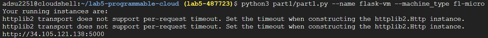

**Instance running in Compute Engine:**

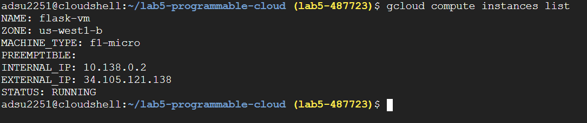

**Flaskr app reachable in browser:**

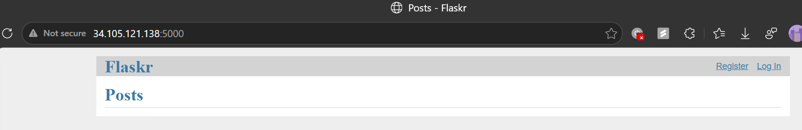

---

## Part 2 — Snapshot + Clone Three VMs + Measure Timing

### Goal
In Part 2, I needed to create a disk snapshot of the Part 1 VM and then create three new VM instances from that snapshot, measuring how long each clone takes.

### Implementation (part2/part2.py)

#### 1) Snapshot creation
I started by reading the source instance (`flask-vm`) and extracting its boot disk name. Then I created the snapshot using the disk API:
`disks().createSnapshot(...)`

The lab required a naming format, so I used:
`base-snapshot-<instance>` → `base-snapshot-flask-vm`

To make the script safe to re-run, I handled the “already exists” case (HTTP 409). If the snapshot already existed, my script simply skipped snapshot creation and continued.

#### 2) Cloning from snapshot
For each clone VM, I created a new instance whose boot disk is initialized from the snapshot:
`sourceSnapshot: projects/<project>/global/snapshots/<snapshot>`

To measure performance, I timed each clone by starting a timer right before calling `instances().insert(...)`, then waiting for the zone operation to reach `DONE`, and stopping the timer after that.

#### 3) TIMING.md
After collecting the results, I wrote the timing data into `TIMING.md` inside the repo so it could be submitted as part of the lab requirements.

### Result

**Snapshot + clone creation timings (terminal output):**

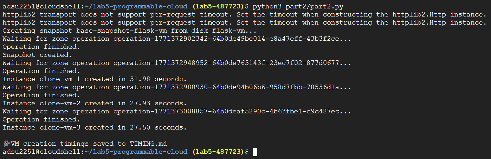

From the run above, the measured clone creation times were:

```text
clone-vm-1: 31.98 seconds
clone-vm-2: 27.93 seconds
clone-vm-3: 27.50 seconds
```

**Snapshot visible in the GCP console:**

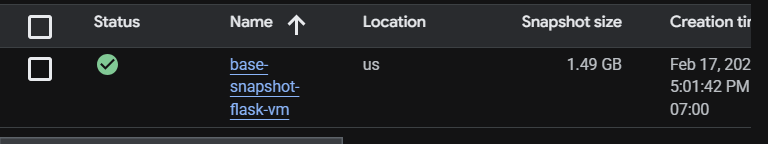

**Cloned instances visible (console + terminal):**

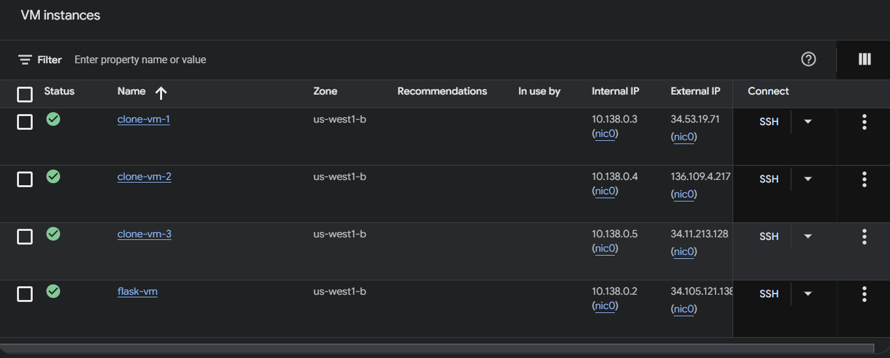

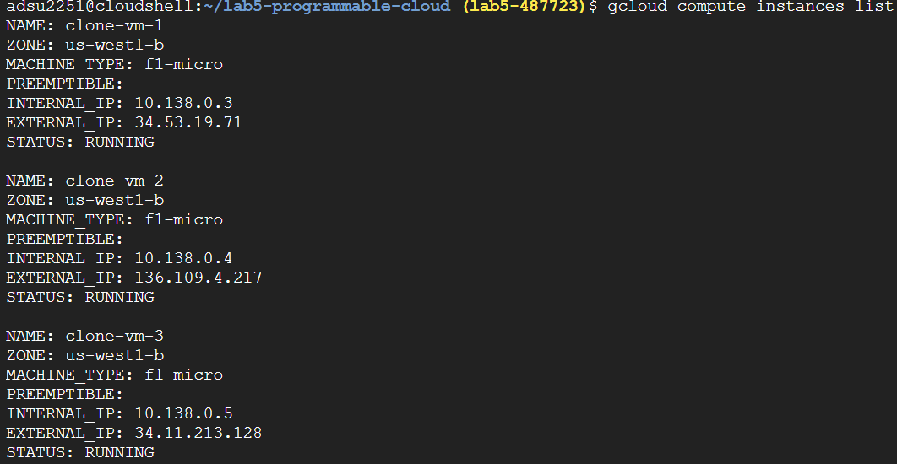

**Cloned VMs serve the same Flaskr app:**

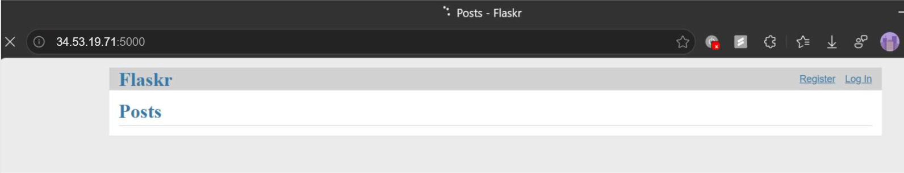

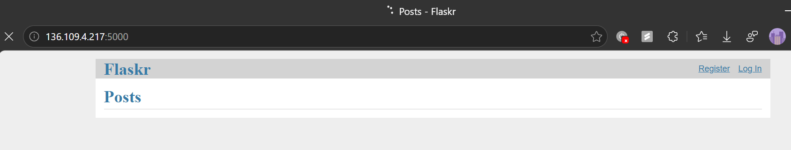

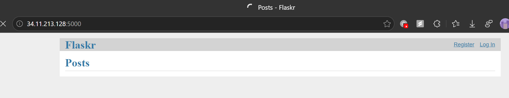

---

## Part 3 — VM Creates Another VM Using a Service Account

### Goal
For Part 3, my goal was to create VM-1 using a service account, and then have VM-1 authenticate to Google Cloud and create VM-2 programmatically.

### Implementation (part3/part3.py)

#### 1) Service account authentication
Unlike Parts 1 and 2 (which used ADC), here I explicitly authenticated using a service account JSON key file:
`service_account.Credentials.from_service_account_file('service-credentials.json')`
Then I built the Compute client using those credentials so the script could create VM-1 under the service account identity.

#### 2) Passing data into VM-1 (metadata)
Since VM-1 needs everything required to create VM-2, I passed the required content through instance metadata. Specifically, I attached:
* `startup-script` (VM-1 bootstrap logic)
* `vm1-launch-vm2-code` (Python code VM-1 runs to create VM-2)
* `vm2-startup-script` (startup script VM-2 will run)
* `service-credentials` (JSON key content so VM-1 can authenticate)

In the VM-1 startup script, I pulled these values from the metadata server (`http://metadata/...`) and wrote them into files under `/srv/`. This made the VM self-contained and able to run the VM-2 creation code automatically.

#### 3) VM-1 launches VM-2
After the files were written, VM-1 executed `vm1-launch-vm2-code.py`. The code:
* loads `/srv/service-credentials.json`
* creates VM-2 using `instances().insert(...)`
* waits until the zone operation reaches `DONE`

**Security note:** VM-2 does not need the service credentials. For a real production design, I would avoid storing a key in metadata and instead attach a service account directly to VM-1.

### Result

**Part 3 script creating VM-1 (VM-1 then launches VM-2):**

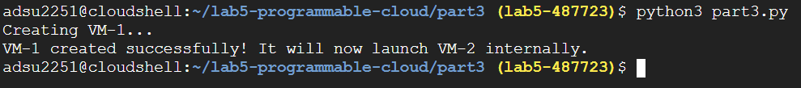

**Both VMs visible after completion:**

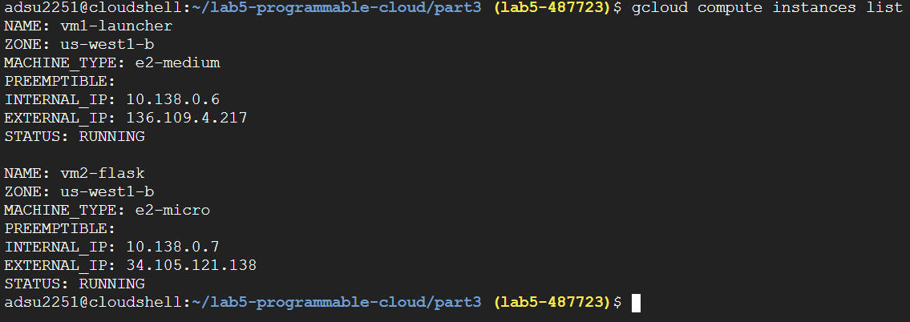

---